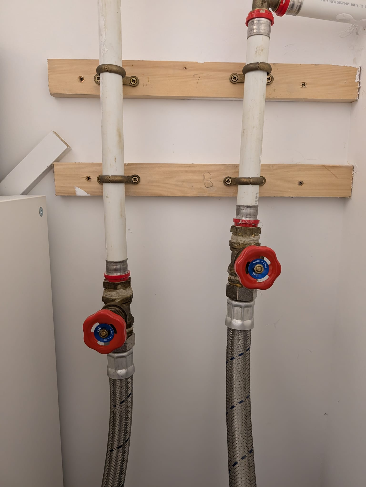

# Basics

## Turn off water supply to house

You will find the stopcock valve inside the cabinet underneath the kitchen sink. Turning it off will prevent the water from outside from getting into the house.

## Turn off water supply to bathrooms

There are a few different ways to prevent water from getting to the bathroom sinks and showers:

### Close water pump valves

The water pump is a device located in the utility room. There are two cables coming off from the pump, each one conected to a valve. Close both valves by turning them to the right to cut off the internal water supply. To turn the water back on, just turn the valves to the left again.

