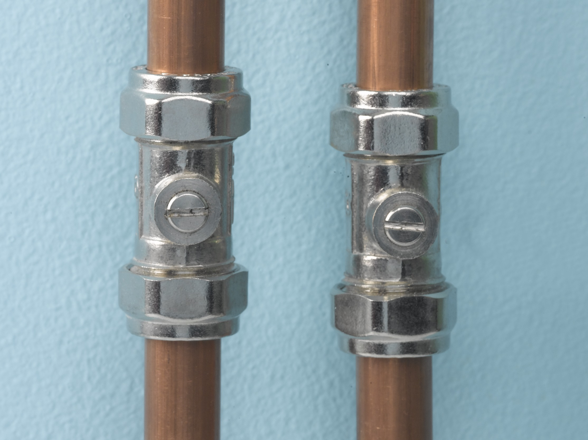

# Basics

## Turn off water supply to house

The stopcock valve is located inside the cabinet underneath the kitchen sink. Turning it off will prevent the external water supply from from getting into the house.

## Turn off water supply to bathrooms

There are a few different ways to prevent water from getting to the bathroom sinks and showers:

### Close water pump valves

The water pump is a device which can be found in the utility room. There are two cables coming off from the pump, each one conected to a valve. Close both valves by turning them to the right to cut off the internal water supply. To turn the water back on, just turn the valves to the left again.

## Turn off water supply to specific taps

There are two flexible cables coming out of kitchen and bathroom taps. If you follow these cables, you will notice these cables are connected to a copper pipe with an isolation valve, which looks like the following:

Using a screwdriver, turn the screw to the horizonal position to close the water supply for that pipe. One pipe is responsible for the hot water and the other one for the cold water. Make sure to close both by opening the tap and confirming water is not coming off.

Click on the image below to see these instruction on Youtube.

