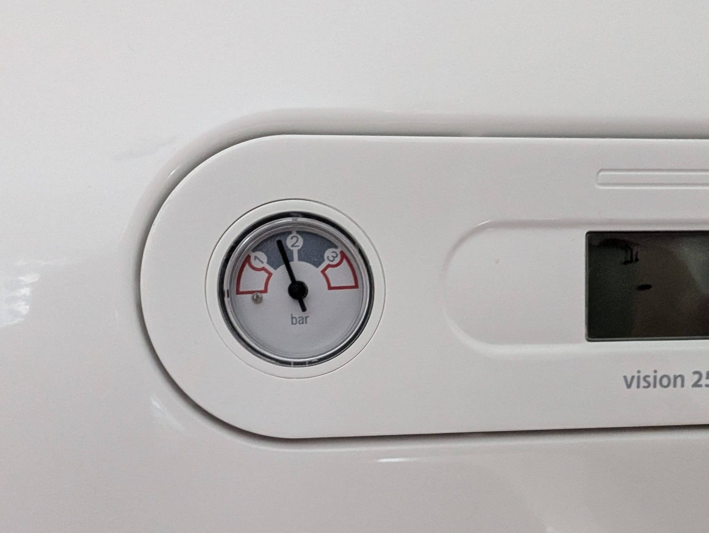
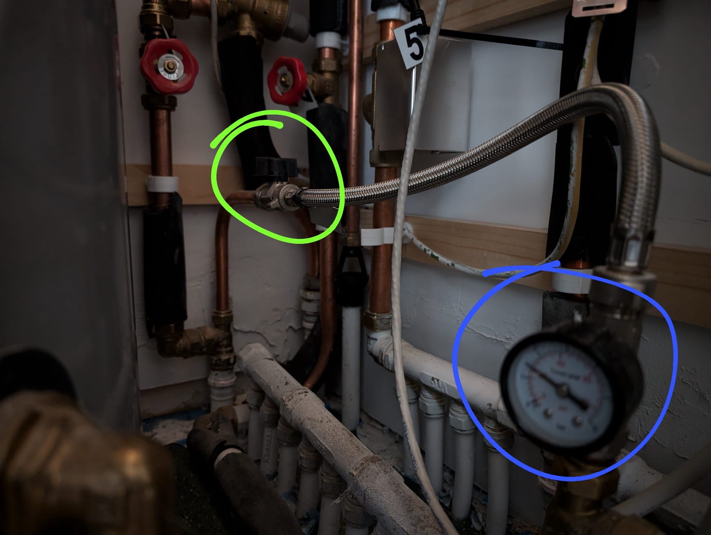

# Boiler

## Keep recommended pressure

A boiler's pressure gauge will usually sit between 1 and 2 bars when it is turned on. The exact recommended pressure level will vary depending on the boiler manufacturer, but generally, anywhere between 1.0 and 2.0 bar is ideal. The pressure level can be verified on the boiler display:

Should the pressure fall below the recommend level, it can be increased by a top-up valve in the hot press. Search for a gauge connected to a pipe and follow said pipe until you find a small black turning valve. Keep an eye on the gauge until the pressure is back to the recommended levels.

In the image above, the pressure gauge is outlined in blue and the top-up valve is outlined in green. 

Click on the image below to see these instruction on Youtube.

